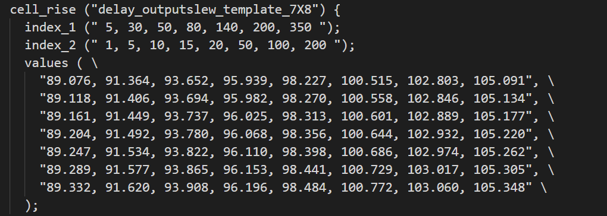
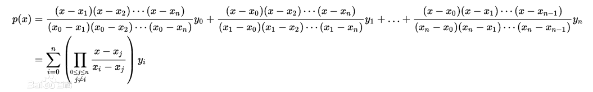
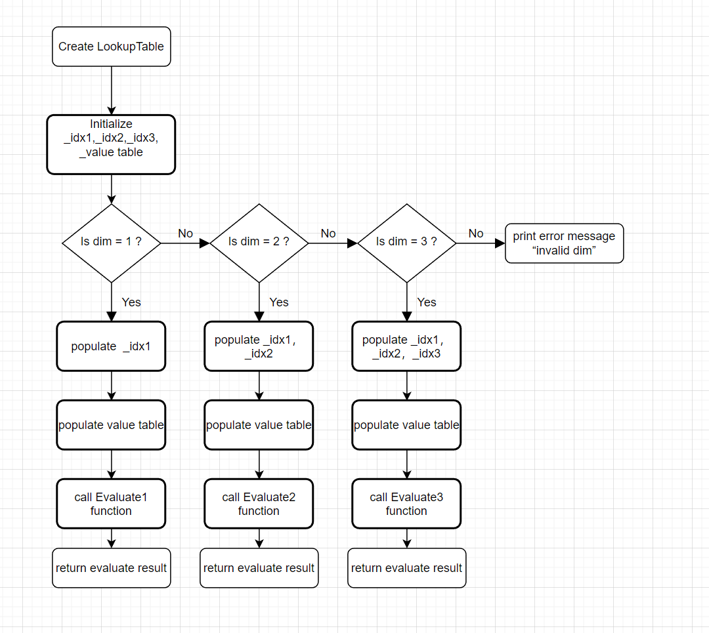
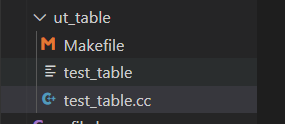

# Liberty中evaluate的实现

## 1.简介

### 1.1 目的

基于opensta中的方法，实现liberty的evaluate功能，计算结果与opensta达到一致。

### 1.2 范围

 - 设计人员: 聂浩然
 - 实现人员: 聂浩然
 - 测试人员: 聂浩然

## 2.设计概要

### 2.1 背景

在目前设计的LookupTable的基础上，添加新的evaluate函数实现功能。

下面是Evaluate函数功能简介：对于二维的evaluate函数（一维三维同理），给入一个7x8的value table，一个x轴index_1, 一个y轴index_2(注意，index_1所对应的是table的列，index2所对应的是table的行)。例如给定一个输入的坐标(30, 1)，把30带入index_1中查找所处index位置，如图可以看出，30在index_1中的下标为1，同理1的index_2中的下标为0。接着根据（1，0）去在value中查询，相当于找value【0】【1】 （index_1代表列，index_2代表行），然后返回此时value的值。如果给定的输入不在index中，需要根据输入值最近的两点查到value值后，进行拟合，计算出近似值返回。具体计算方法后文会详细介绍。



（value table和index table都是有序的，一般是从小到大顺序）

LookupTable类中有dim用于判断table的维度，对于内部可以通过设计3个针对不同的维度的evaluate函数分别处理。使用前需要通过setIndex()，setValue()接口先加载数据。

第一步先通过unit测试来确保evaluate的正确性，第二步再整体测试。

### 2.2 接口描述

#### 2.2.1 FindIndex

```c++
 size_t FindIndex(double input_value, const std::vector<double>& value);
```


#### 2.2.2 Evaluate接口

```c++
 double Evaluate1(double input_idx1);
 double Evaluate2(double input_idx1,double input_idx2);
 double Evaluate3(double input_idx1,double input_idx2,double input_idx3);
```

#### 2.2.3 CheckConsistency接口

```c++
bool CheckConsistency();
```

## 3.详细设计

### 3.1 FindIndex实现说明

FindIndex函数用于实现功能是，给定一个输入value以及一个vector，查找到value值在此vector中最近的两个值中较小值的index。

例如：std::vector <double> _idx1{5, 30, 50, 80, 140, 200, 350};

​			double value = 25；

此时25在vector _idx1中最近的两个值是5和30，较小值为5，它的index是0，所以函数返回0；如果给定值在vector的左侧或者右侧，那么最近的两个值为vector最小的2个值或vector最大的2个值。

函数查询具体实现为二分查找。

### 3.2 Evaluate实现说明

从简单的一维开始:

对于给定一个输入值x，首先我们需要调用FindIndex函数找到其中较小值x_low的index，那么index+1为另一个值x_up的index，还可以通过value table获取y1，y2分别为x_low,x_up在value table中对应的值。接下来通过离散数学中的线性插值（Linear Interpolation）公式，套入代码就可以了。

[线性插值百度百科](https://baike.baidu.com/item/%E7%BA%BF%E6%80%A7%E6%8F%92%E5%80%BC)

```c++
size_t index1 = FindIndex(input_idx1,_idx1);
double x1 = input_idx1;
double x1_low = _idx1[index1];
double x1_up = _idx1[index1 + 1];
double y1 = _value[index1];
double y2 = _value[index1 + 1];
double dx1 = (x1 - x1_low) / (x1_up - x1_low);
return (1 - dx1) *y1 + dx1 * y2;
```


对于二维以及三维同理，插值方式为多项式插值，公式如图：



注意：在二维三维通过index获取对应y值的时候，需要计算偏移量offset，因为value的值是以一维vector存储。

```c++
// 二维
size_t index1_offset1 = index1 * size2;
double y00 = _value[index1_offset1 + index2];
double y01 = _value[index1_offset1 + index2 + 1];
size_t index1_offset2 = (index1 + 1) * size2;
double y10 = _value[index1_offset2 + index2];
double y11 = _value[index1_offset2 + index2 + 1];
//三维
size_t index1_offset1 = index1 * size2;
size_t index1_offset2 = (index1 + 1) * size2;
size_t index2_offset1 = index2;
size_t index2_offset2 = index2 + 1;
size_t table_xy = size1 * size2;
size_t index3_offset1 = index3 * table_xy;
size_t index3_offset2 = (index3 + 1) * table_xy;
```

例如二维中，需要先通过计算index_1所产生的偏移量，在加上index_2才能获取到正确位置的值。

### 3.3 CheckConsistency实现说明

根据LookupTable中_dim维度参数，判断当前index和value的size是否匹配，在Evaluate中调用用于判断一致性。

```C++
bool LookupTable::CheckConsistency() {
    if (_dim == 1) {
       return (_idx1.size() == _value.size()); 
    }
    if (_dim == 2) {
       return (_idx1.size() * _idx2.size() == _value.size());
    }
    if (_dim == 3) {
       return (_idx1.size() * _idx2.size() * _idx3.size() == _value.size());
    }
    return false;
}
```


## 4.ut测试流程

**流程图如下：**



ut_table测试在liberty目录下, 编译过后通过 command line 传入dim，input value等参数。



```c++
void Help() {
    std::cout
        << "Command-Line Options:" << std::endl
        << "  -d <int>    : the dimension of table" << std::endl
        << "  -x <double> : the input value of index1" << std::endl
        << "  -y <double> : the input value of index2" << std::endl
        << "  -z <double> : the input value of index3" << std::endl
        << "  -h          : display the help menu" << std::endl << std::endl;
    exit(0);
}

void Parseargs(int argc, char** argv, int &d, double &x, double &y, double &z) {
    int opt;
    while ((opt = getopt(argc, argv, "d:x:y:z:h")) != -1) {
        switch (opt) {
          case 'd': d = atoi(optarg); break;
          case 'x': x = atof(optarg); break;
          case 'y': y = atof(optarg); break;
          case 'z': z = atof(optarg); break;
          case 'h': Help(); break;
        }
    }
}
```


