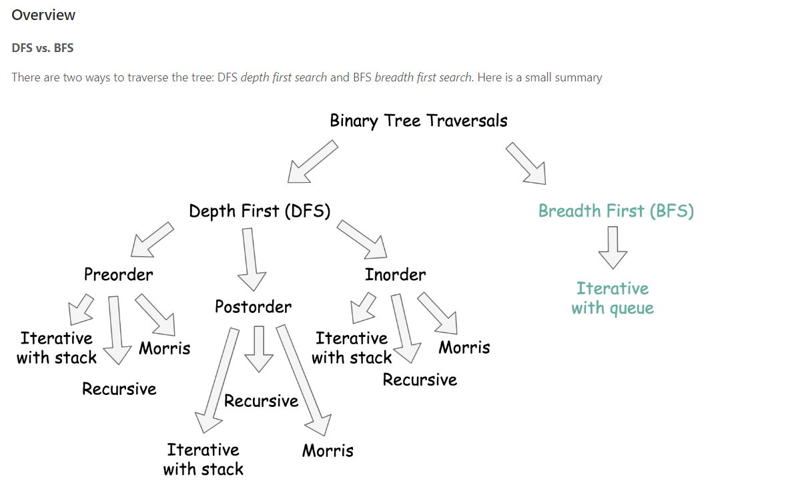
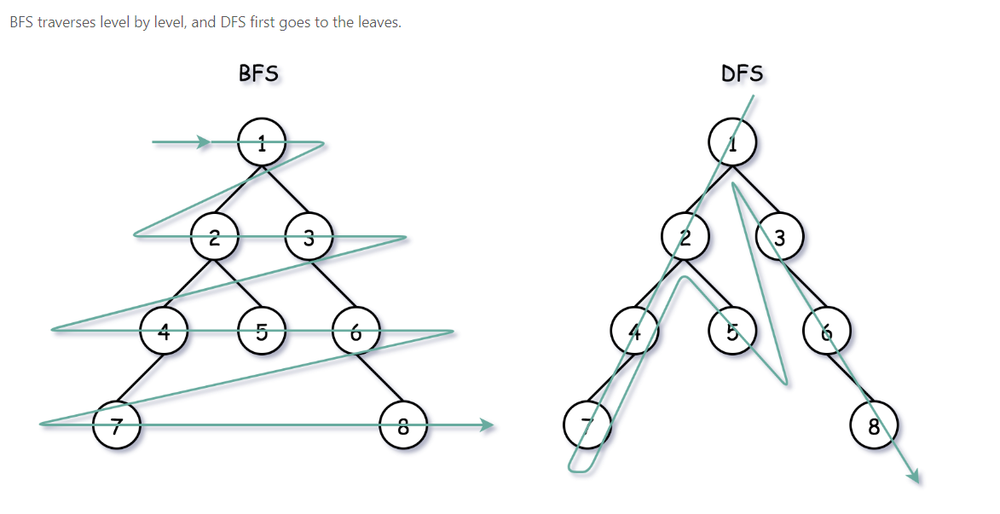

# C++

string 类型不能用switch需要转化为char或其它类型，例如直接使用[]访问， char a = string[1]  

vector 和 queue都有emplace function可以替代push 优化之前push操作需要copy object的操作  
vector.emplace_back()  queue.emplace() 

binaray search中  
int middle = low + (high - low) / 2  可以防止溢出，功能等效于(low + high) / 2  
此外使用>>右移运算符 >>1 功能等于 /2 不过注意优先级顺序，移位运算符优先级低于+ - x /等  

n & 1 位运算判断奇偶

char类型与int类型之间转换要看ASCII码  
如'0' - '0' = 0  
  '0' + 1 = '1'  
  'a' - 'a' = 0  
例子：lc 67题  
```c++ 
string a  
for (int i = 0; i < a.size(); ++i)) {    
    int carry = a[i] - '0';  
}  

string s = "1238";   
int n = 0;  
for (int i = 0; i < s.size(); i++) {  
    char c = s[i];  
    n = 10 * n + (c - '0');  
}  
```
std::string 在c++ 11后string字符串都是以'\0'结尾  


STL::list 是double linkedlist实现的   

## Backtracking

```c++
void backtracking(参数) {
    if (终止条件) {
        存放结果;
        return;
    }

    for (选择：本层集合中元素（树中节点孩子的数量就是集合的大小）) {
        处理节点;
        backtracking(路径，选择列表); // 递归
        回溯，撤销处理结果
    }
}
```


## BST:Binaray search tree

- The left subtree of a node contains only nodes with keys **less than** the node's key.

- The right subtree of a node contains only nodes with keys **greater than** the node's key.

- Both the left and right subtrees must also be binary search trees.

  

## BFS and DFS

DFS: 使用递归，隐含使用系统栈
有三种方式遍历树，前序中序后序 
例子lc 110

BFS:使用queue实现
应用场景 层序遍历，最短路径
例子lc 994, lc 102（利用level）


通过preorder和inorder构建树的时候要注意构建子树的顺序
e.g. 在后序遍历的数组中整个数组是先存储左子树的节点，再存储右子树的节点，最后存储根节点，如果按每次选择「后序遍历的最后一个节点」为根节点，则先被构造出来的应该为右子树。
lc 106
**DFS vs BFS**






## DSU(Disjoint Set Union) 查并集

Tips: 

- 一般不会将并查集使用得太复杂，内部结构如果过于复杂，也难以维护
- 只负责维护连通性
- 存在区间合并的题干，应当考虑使用并查集
- 如果题干是拆分连通分量，反向思维，考虑逆向使用并查集

```c++
// 注意：使用该代码，并不能使得所有的元素都直接指向根节点，仍然存在间接指向
class Djset {
public:
    vector<int> parent;  // 记录节点的根
    vector<int> rank;    // 记录根节点的深度（用于优化）
    int count;           // 记录并查集的数量,某些情况下该成员非必要
    Djset(int n): parent(vector<int>(n)), rank(vector<int>(n)), count(n) {
        for (int i = 0; i < n; i++) {
            parent[i] = i;
        }
    }
    
    int find(int x) {
        // 压缩方式：直接指向根节点
        if (x != parent[x]) {
            parent[x] = find(parent[x]);
        }
        return parent[x];
    }
    
    void merge(int x, int y) {
        // 找到根节点
        int rootx = find(x);
        int rooty = find(y);
        if (rootx != rooty) {
            // 按秩合并
            // 把小的指向大的
            if (rank[rootx] < rank[rooty]) {
                swap(rootx, rooty);
            }
            parent[rooty] = rootx;
            count--;
            // 如果秩相等，将父节点rootx秩 + 1
            if (rank[rootx] == rank[rooty]) rank[rootx] += 1;
        }
    }
};
```


## Topological Sorting

idea：针对Directed acyclic graph (DAG)找到一个可以执行的线性顺序

Tips：

- 如果这个图不是 DAG，那么它是没有拓扑序的；
- 如果是 DAG，那么它至少有一个拓扑序；
- 反之，如果它存在一个拓扑序，那么这个图必定是 DGA.

## Heap

通过大小堆一起作用可以常数时间找到中位数median.
Defination: priority_queue<Type, Container, Functional>
priorty_queue<pair<int,int>> q  
<greater<int>> 小根堆
<less<int>> 大根堆
override: a < b 大根堆 a > b 小根堆
自定义cmp模版：
```c++
    // 1. lambda expression
    auto cmp = [&](ListNode* a, ListNode* b) {
            return a->val > b->val;   
        };
    priority_queue<ListNode*, vector<ListNode*>, decltype(cmp)> qu(cmp);
    // 2. struct
    struct comp {
        bool operator()(ListNode* a, ListNode* b) {
            return a->val > b->val;
        }
    };
    priority_queue<ListNode*, vector<ListNode*>, comp> q;
```
在优先队列中使用pair默认先比较第一个元素在比较第二个元素  