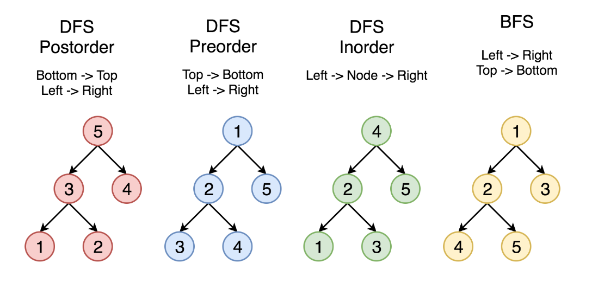

C++

string 类型不能用switch需要转化为char或其它类型，例如直接使用[]访问， char a = string[1]

vector 和 queue都有emplace function可以替代push 优化之前push操作需要copy object的操作
vector.emplace_back()  queue.emplace()

priorty_queue<pair<int,int>> q
在优先队列中使用pair默认先比较第一个元素在比较第二个元素

binaray search中
int middle = low + (high - low) / 2  可以防止溢出，功能等效于(low + high) / 2
此外使用>>右移运算符 >>1 功能等于 /2 不过注意优先级顺序，移位运算符优先级低于+ - x /等

char类型与int类型之间转换要看ASCII码 
如'0' - '0' = 0
  '0' + 1 = '1'
  'a' - 'a' = 0
例子：lc 67题
string a
for (int i = 0; i < a.size(); ++i)) {
    int carry = a[i] - '0';
}

STL::list 是double linkedlist实现的

BST:Binaray search tree
- The left subtree of a node contains only nodes with keys **less than** the node's key.
- The right subtree of a node contains only nodes with keys **greater than** the node's key.
- Both the left and right subtrees must also be binary search trees.

BFS and DFS

DFS: 使用递归，隐含使用系统栈
有三种方式遍历树，前序中序后序 
例子lc 110

BFS:使用queue实现
应用场景 层序遍历，最短路径
例子lc 994

